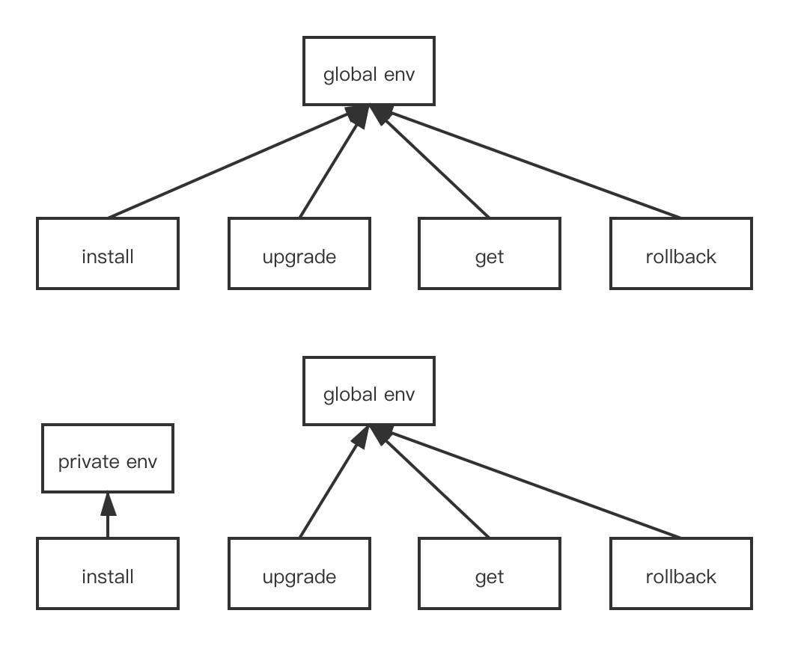

# helm-go-client

将kubernetes包管理器helm封装成库使用。当前对应helm版本: v3.6.3

## 背景
helm是kubernetes的包管理器，需要编译成二进制文件来使用。由于helm内部封装良好，我们很难直接将其作为库来使用。因此采用在helm上封装一层的方式，同时尽可能少地触及其核心逻辑，只在必要的时候抽取出部分内部代码，以方便与helm最新版本同步维护。

helm提供了非常多的命令行参数配置项，helm-go-client对此最大程度上提供了支持。

## 与原生helm的不同之处
原生helm是基于命令行库cobra实现的，有很多个子命令，如install、upgrade、get、rollback等等。

在helm中，参数分为全局参数和子命令参数。全局参数所有子命令可见，子命令参数只在对应的子命令中有效。

为了对helm的这些特性提供支持，同时尽可能分离各子命令的执行环境，在初始时所有子命令共用一个全局环境。在子命令中可以通过OverrideGlobalOpts和OverrideGlobalOptsWithNamespace两个函数重设全局环境。例如，对install重设全局环境后如下图所示。

这样只会影响install命令自身，而不会对其他命令的执行环境产生影响。

## 支持的功能
helm-go-client支持helm的绝大多数命令。其中，对于支持的helm命令，对里面的所有参数配置项也均提供了支持。

出于某些原因和考虑，对少数的helm命令没有提供支持。例如，没有对dependency相关命令提供支持的原因是其中引用了internal包；没有对plugin相关命令提供支持的原因是其中调用了exec函数，在服务器程序上调用可能引起问题。未来基于helm版本的变更，不排除作对应修改的可能。

简单起见，helm-go-client不提供任何并发安全的保证。

## 使用
helm-go-client的使用很简单，以install命令为例：
```go
func install() error {
    cli := helmclient.NewHelmClient(kubeConfigForTest, "default")
    installCli, err := cli.Install([]helmclient.InstallOption{}, []helmclient.ValueOption{}, []helmclient.ChartPathOption{})
    if err != nil {
        return err
    }
    release, err := installCli.Install([]string{"hello-app", "/Users/bytedance/helm/hello-app"})
    if err != nil {
        return err
    }
}
```
对于其他命令，可以参照test目录下的测试程序。由于测试程序中去掉了敏感信息，所以无法直接运行，用户在使用时可以根据情况进行修改。

仍然以install命令为例，子命令参数用helmclient.InstallOption传入。如：
```go
installCli, err := cli.Install([]helmclient.InstallOption{InstallWithTimeout(time.second * 500)}, []helmclient.ValueOption{}, []helmclient.ChartPathOption{})
```
这样就覆盖了默认的timeout参数(300s)。可以在源码中查看如何覆盖各命令的对应参数。